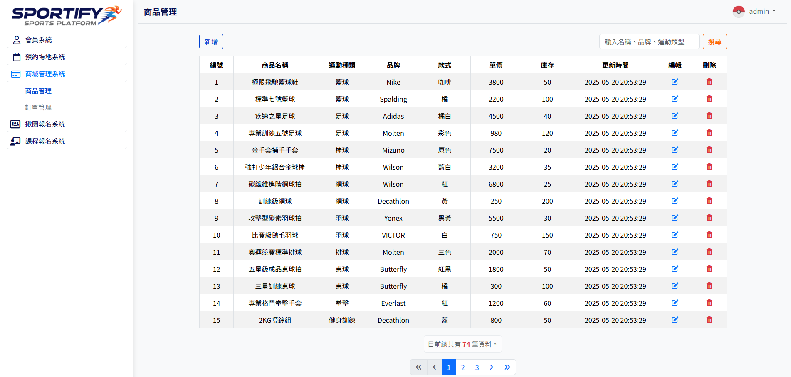
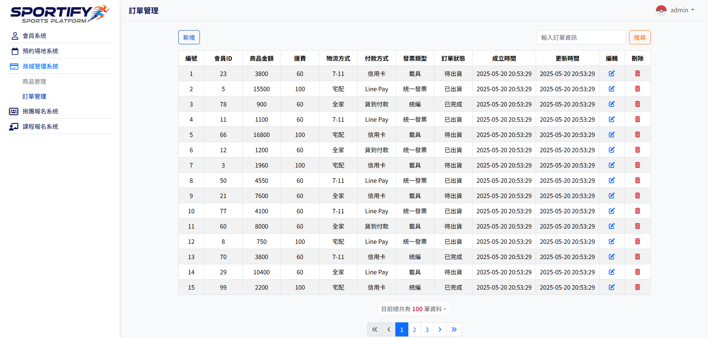

# 運動整合平台：商城後台管理系統

## 專案簡介
本專案是**運動整合平台**的後台管理系統，我主要負責其中的**商城介面**。此模組提供強大的功能，讓管理者能夠對商品與訂單進行全面的 **CRUD (增、刪、改、查)** 操作，確保商城的營運順暢與資料準確。

---

## 主要功能
本商城後台的核心功能包括：

* **商品管理**：對平台上的商品進行完整的 CRUD 操作。
* **訂單管理**：處理與追蹤所有客戶訂單，並提供 CRUD 功能。
* **搜尋功能**：快速搜尋商品或訂單，以利管理者迅速找到所需資訊。
* **權限控管**：根據使用者身份（例如：管理員 vs. 一般使用者）來顯示不同的介面與功能。

---

## 功能詳情

### 商品管理
| 功能 | 說明 |
| :--- | :--- |
| **新增商品** | 建立新的商品項目，包含名稱、價格、庫存、規格及圖片。 |
| **編輯商品** | 修改現有商品的詳細資訊與規格。 |
| **刪除商品** | 從資料庫中移除指定商品及其所有規格。 |
| **瀏覽商品** | 查看所有商品的清單，並根據使用者權限顯示不同內容。 |
| **搜尋商品** | 透過商品名稱、運動種類或品牌名稱等關鍵字快速篩選。 |

### 訂單管理
| 功能 | 說明 |
| :--- | :--- |
| **新增訂單** | 建立新的訂單項目（主要用於測試或特殊情況），並處理訂單明細、運費與總金額計算。 |
| **編輯訂單** | 修改訂單的狀態、運費、地址、付款方式等資訊，並支援新增或刪除訂單明細。 |
| **刪除訂單** | 從資料庫中永久移除指定的訂單及其所有明細。 |
| **瀏覽訂單** | 查看所有訂單的清單，具備權限檢查，僅限管理員可訪問。 |
| **搜尋訂單** | 根據訂單編號、會員 ID、狀態、物流或付款方式快速篩選。 |

---

## 程式碼結構與 API 說明
後端邏輯與前端頁面分開，每個檔案負責特定的頁面顯示或後端資料處理。

### 商品管理程式碼
| 檔案名稱 | 類型 | 功能說明 |
| :--- | :--- | :--- |
| `products_add-api.php` | **後端處理** | 處理新增商品的資料，包含商品主資料、單一規格與圖片上傳。 |
| `products_add_spec-api.php` | **後端處理** | 處理新增商品規格的資料，包含規格細節與圖片上傳。 |
| `products_delete-api.php` | **後端處理** | 根據規格 ID 刪除規格，若為最後一筆規格，則一併刪除商品主資料與圖片檔案。 |
| `products_edit-api.php` | **後端處理** | 處理編輯商品主資料、規格與圖片，包含新增圖片和刪除舊圖片。 |
| `products_add.php` | **前端頁面** | 提供新增商品的表單介面。 |
| `products_edit.php` | **前端頁面** | 編輯商品主資料與規格的表單介面，支援切換不同的規格進行編輯。 |
| `products_add_spec.php` | **前端頁面** | 提供新增商品規格的表單介面，並顯示該商品現有的規格清單。 |
| `products_list.php` | **邏輯判斷** | 判斷使用者角色（`admin` 或非 `admin`），並載入 `products_list_admin.php` 或 `products_list_no_admin.php`。 |
| `products_list_admin.php` | **前端頁面** | 顯示商品清單，包含「編輯」與「刪除」按鈕。 |
| `products_list_no_admin.php` | **前端頁面** | 顯示商品清單，但隱藏管理功能按鈕。 |

### 訂單管理程式碼
| 檔案名稱 | 類型 | 功能說明 |
| :--- | :--- | :--- |
| `orders_add-api.php` | **後端處理** | 處理新增訂單的表單資料，並將訂單與其明細寫入資料庫。 |
| `orders_edit-api.php` | **後端處理** | 處理編輯訂單的表單資料，包含更新主訂單資訊、新增/刪除/編輯訂單明細。 |
| `orders_delete-api.php` | **後端處理** | 根據訂單 ID 刪除訂單及其所有明細。 |
| `orders_add.php` | **前端頁面** | 提供新增訂單的表單介面，支援動態新增訂單明細。 |
| `orders_edit.php` | **前端頁面** | 提供編輯訂單的表單介面，並支援動態修改訂單明細。 |
| `orders_list.php` | **前端頁面** | 顯示訂單清單，具備權限檢查，僅 `admin` 可訪問。 |

---

## 技術

* **前端**：HTML、CSS、JavaScript、Bootstrap
* **後端**：PHP
* **資料庫**：MySQL
* **版本控制**：Git

